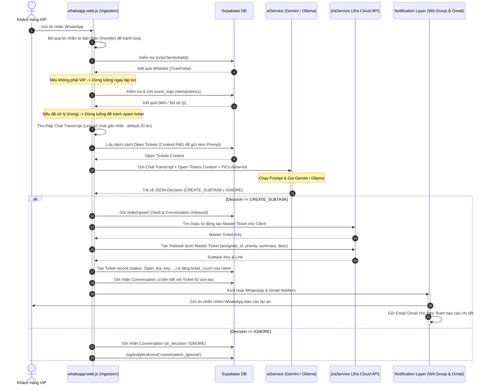

# HỆ THỐNG TỰ ĐỘNG HÓA VẬN HÀNH DANTA LABS
## TÀI LIỆU BÀN GIAO NGỮ CẢNH DỰ ÁN CHO CHAT AI TIẾP THEO (SYSTEM_CONTEXT_FOR_AI.md)

Tài liệu này cung cấp cái nhìn toàn diện, cấu trúc chi tiết, sơ đồ luồng dữ liệu (Dataflow) và kiến trúc hệ thống (System Architecture) dạng Mermaid code để phiên làm việc của AI tiếp theo có thể lập tức hiểu rõ nghiệp vụ, mã nguồn, cách vận hành và tiếp quản công việc thiết kế/lập trình hiệu quả.

---

## 1. TỔNG QUAN DỰ ÁN (PROJECT OVERVIEW)

### 1.1 Dự án này giải quyết bài toán gì?
Dự án **AdminOps Support Automation** là hệ thống tự động hóa vận hành kép, phục vụ cho DantaLabs nhằm chuyển đổi các cuộc hội thoại phi cấu trúc của khách hàng từ WhatsApp thành các hành động xử lý cụ thể, có cấu trúc trong hệ thống quản trị nội bộ.

Hệ thống hoạt động dưới hai cấu phần tương hỗ:
1. **Backend Engine (Node.js Pipeline)**: Chạy nền, liên tục lắng nghe tin nhắn WhatsApp từ các khách hàng VIP được cấu hình trước. Khi có tin nhắn mới, hệ thống phân tích ngữ cảnh lịch sử chat (RAG) + danh sách các công việc hiện tại, gửi qua AI (Gemini hoặc Ollama) để đưa ra quyết định tự động. Nếu hành động là cần thiết (`CREATE_SUBTASK`), hệ thống sẽ tạo ticket Jira (dưới dạng subtask của khách hàng đó), lưu vào cơ sở dữ liệu Supabase, đồng thời gửi thông báo tức thời cho đội ngũ Ops qua nhóm WhatsApp nội bộ và Gmail.
2. **Management Dashboard (Next.js Frontend)**: Cung cấp giao diện Web trực quan (React 19, Next 16, Tailwind CSS) kết nối trực tiếp đến Supabase để đội ngũ Ops theo dõi danh sách khách hàng VIP, lịch sử trò chuyện chi tiết, các Ticket được tạo tự động, biểu đồ phân tích hiệu suất (Analytics Timeline) và tùy chỉnh các cài đặt của hệ thống.

### 1.2 Các công nghệ cốt lõi (Tech Stack)
*   **Runtime & Server**: Node.js (>= 18), Express (dùng cho Healthcheck `GET /ping` trên môi trường Deploy như Render).
*   **WhatsApp Ingestion & Notification**: `whatsapp-web.js` kết hợp với `qrcode-terminal` để quét mã QR xác thực phiên chạy thực tế.
*   **AI Decisioning**: `@google/generative-ai` (mặc định sử dụng model Gemini Flash) hoặc gọi API local thông qua **Ollama** (sử dụng Llama 3).
*   **Database & Operations State**: **Supabase** (`@supabase/supabase-js`) lưu trữ toàn bộ trạng thái hoạt động, danh sách VIP clients, nhật ký trùng lặp (Idempotency Logs), hội thoại, tickets, analytics và settings.
*   **Ticketing & Project Management**: **Jira Cloud REST API v3** (truy vấn qua Axios sử dụng phương thức xác thực Basic Auth).
*   **Email Alerting**: **Nodemailer** tích hợp SMTP Gmail gửi mail báo cáo sự kiện tự động.
*   **Web Dashboard**: **Next.js 16** (React 19, Tailwind CSS, TypeScript), kiến trúc App Router kết hợp các API route cục bộ kết nối đến Supabase.

---

## 2. KIẾN TRÚC HỆ THỐNG (SYSTEM ARCHITECTURE)

Hệ thống được tổ chức dạng Module hóa cao, phân rõ vai trò của phần chạy ngầm (Pipeline Engine) và giao diện trực quan (Dashboard). 

Dưới đây là sơ đồ kiến trúc hệ thống trực quan:

```mermaid
graph TD
    %% Styling
    classDef client fill:#f9f,stroke:#333,stroke-width:2px;
    classDef nodeApp fill:#bbf,stroke:#333,stroke-width:2px;
    classDef cloud fill:#fbb,stroke:#333,stroke-width:2px;
    classDef db fill:#bfb,stroke:#333,stroke-width:2px;

    %% Elements
    User((Khách hàng VIP)):::client
    OpsTeam((Ops Team / PICs)):::client

    subgraph Node_Server [Node.js Engine (Backend Pipeline)]
        WA_Ingest[whatsappIngestion.js]:::nodeApp
        Index[index.js - Entrypoint]:::nodeApp
        AI_Serv[aiService.js]:::nodeApp
        Jira_Serv[jiraService.js]:::nodeApp
        SB_Serv[supabaseService.js]:::nodeApp
        WA_Notify[whatsappNotifyService.js]:::nodeApp
        Gmail_Serv[gmailService.js]:::nodeApp
    end

    subgraph Supabase_Cloud [Supabase Cloud Database]
        DB_Vip[(vip_clients)]:::db
        DB_Logs[(event_logs)]:::db
        DB_Clients[(clients)]:::db
        DB_Tickets[(tickets)]:::db
        DB_Conv[(conversations)]:::db
        DB_Settings[(settings)]:::db
        DB_Analytics[(analytics_events)]:::db
    end

    subgraph NextJS_Dashboard [Next.js Web Dashboard - Frontend UI]
        Dash_Page[Dashboard Overview Page]:::nodeApp
        Client_Page[Clients Whitelist Page]:::nodeApp
        Ticket_Page[Tickets Status Page]:::nodeApp
        Conv_Page[Conversations Audit Page]:::nodeApp
        Set_Page[System Settings Page]:::nodeApp
        API_Routes[Next.js API Routes]:::nodeApp
    end

    subgraph External_APIs [External Integrations]
        Gemini[Google Gemini API]:::cloud
        Ollama[Ollama Local LLM]:::cloud
        Jira_API[Jira Cloud REST API v3]:::cloud
        Gmail_SMTP[Gmail SMTP Server]:::cloud
    end

    %% Flows & Interactions
    User -->|Tin nhắn WhatsApp| WA_Ingest
    WA_Ingest -->|Gửi Event| Index
    Index -->|1. Whitelist & Deduplication| SB_Serv
    SB_Serv <--> DB_Vip
    SB_Serv <--> DB_Logs

    Index -->|2. RAG Context| SB_Serv
    SB_Serv <--> DB_Tickets

    Index -->|3. Gọi LLM Decision| AI_Serv
    AI_Serv <-->|Gemini API / Ollama REST| External_APIs

    Index -->|4. Tạo Master/Subtask| Jira_Serv
    Jira_Serv <-->|REST API v3| Jira_API

    Index -->|5. Multi-channel Notify| WA_Notify
    Index -->|6. Multi-channel Notify| Gmail_Serv
    WA_Notify -->|Gửi Group WhatsApp| OpsTeam
    Gmail_Serv -->|Gửi Email Báo cáo| OpsTeam

    Index -->|7. Lưu trạng thái & Lịch sử| SB_Serv
    SB_Serv --> DB_Clients
    SB_Serv --> DB_Conv
    SB_Serv --> DB_Analytics

    %% NextJS connections
    API_Routes <--> Supabase_Cloud
    Dash_Page --> API_Routes
    Client_Page --> API_Routes
    Ticket_Page --> API_Routes
    Conv_Page --> API_Routes
    Set_Page --> API_Routes
```

---

## 3. LUỒNG DỮ LIỆU CHI TIẾT (END-TO-END DATAFLOW)

Khi khách hàng gửi một tin nhắn đến tài khoản WhatsApp được tích hợp, hệ thống sẽ chạy qua luồng xử lý nghiêm ngặt sau:



---

## 4. CHI TIẾT CÁC CẤU PHẦN MÃ NGUỒN (CODEBASE DIRECTORY MAP)

```
Trae-SOLO-YYDS/
├── .env                          # Biến môi trường local (Không được commit)
├── .env.example                  # Mẫu cấu hình môi trường chuẩn
├── index.js                      # Entrypoint của Backend Engine, xử lý pipeline sự kiện
├── tsconfig.json / jsconfig.json # Cấu hình TypeScript & Node Path resolution (@/*)
├── package.json                  # Cấu hình dependency, phiên bản engine và các lệnh scripts
├── supabase/                     # Lưu trữ kịch bản SQL Database
│   ├── schema.sql                # Schema cơ bản ban đầu (vip_clients, event_logs)
│   └── migration.sql             # Toàn bộ SQL định nghĩa bảng, chỉ mục và function
├── src/
│   ├── env.js                    # Trình xác thực (Validate) chặt chẽ biến môi trường khi startup
│   ├── lib/
│   │   └── supabase.js           # Khởi tạo instance Supabase Client
│   ├── services/                 # Thư mục chứa các module nghiệp vụ tách biệt
│   │   ├── aiService.js          # Xây dựng prompt, gọi LLM, xử lý phân tách chuỗi JSON & validation
│   │   ├── jiraService.js        # Gọi REST API Jira, xử lý Master Ticket per Client & Subtask/Comment
│   │   ├── supabaseService.js    # Tương tác Supabase DB (CRUD, Analytics timeline, Whitelist)
│   │   ├── whatsappIngestion.js  # Lắng nghe WhatsApp, quét QR, nạp Transcript, áp dụng Gates
│   │   ├── whatsappNotifyService.js # Gửi thông báo đến nhóm WhatsApp nội bộ
│   │   ├── gmailService.js       # Gọi SMTP nodemailer gửi thông tin báo cáo sự kiện qua Email
│   │   ├── opsNotificationFormatter.js # Format nội dung văn bản thông báo dạng Plain text
│   │   └── telegramService.js    # Module cũ gửi Telegram (Đã ngừng sử dụng)
│   └── app/                      # Giao diện quản trị Next.js (App Router)
│       ├── layout.tsx            # Bố cục cơ bản của ứng dụng
│       ├── page.tsx              # Fallback entrypoint frontend
│       ├── globals.css           # Cấu hình phong cách thiết kế Vanilla CSS + Tailwind
│       ├── api/                  # Các endpoint API phục vụ cho giao diện Next.js
│       │   ├── analytics/        # Endpoint tổng hợp dữ liệu biểu đồ và thống kê hiệu suất
│       │   ├── clients/          # API quản lý và Whitelist VIP clients
│       │   ├── conversations/    # API truy vấn lịch sử hội thoại tự động
│       │   └── tickets/          # API quản trị thông tin Jira tickets
│       └── (dashboard)/          # Group routes giao diện quản lý
│           ├── page.tsx          # Trang thống kê tổng quan (Dashboard)
│           ├── sidebar.tsx       # Thanh điều hướng trái cực đẹp của hệ thống
│           ├── header.tsx        # Thanh công cụ hiển thị thông tin phía trên cùng
│           ├── clients/          # Giao diện quản lý Whitelist khách hàng VIP
│           ├── tickets/          # Giao diện xem tiến độ Jira tickets
│           ├── conversations/    # Giao diện theo dõi lịch sử chat của hệ thống
│           └── settings/         # Giao diện điều chỉnh cấu hình hệ thống
```

---

## 5. THIẾT KẾ CƠ SỞ DỮ LIỆU (SUPABASE SCHEMA DETAILED)

Hệ thống lưu trữ dữ liệu tại Supabase với cấu trúc chi tiết được định nghĩa trong `supabase/migration.sql`:

### 5.1 Bảng `vip_clients`
Lưu danh sách Whitelist các số điện thoại/Group WhatsApp được hệ thống tiếp nhận. Nếu tin nhắn đến không thuộc bảng này, bot tự động bỏ qua.
*   `chat_id` (`text`, Primary Key): Định dạng chatId của WhatsApp (VD: `84912345678@c.us` hoặc `1203631987654321@g.us`).
*   `created_at` (`timestamptz`): Thời điểm thêm vào whitelist.

### 5.2 Bảng `event_logs`
Đảm bảo tính duy nhất (Idempotency), tránh việc quét hay trùng tin nhắn dẫn đến tạo hàng loạt ticket trùng lặp.
*   `message_id` (`text`, Primary Key): ID định danh tin nhắn của WhatsApp (`message.id._serialized`).
*   `created_at` (`timestamptz`): Thời điểm xử lý tin nhắn.

### 5.3 Bảng `clients`
Lưu trữ hồ sơ thông tin và số lượng yêu cầu của các khách hàng đã từng tương tác.
*   `chat_id` (`text`, Primary Key): ID trò chuyện WhatsApp.
*   `display_name` (`text`): Tên hiển thị thu được từ profile WhatsApp.
*   `assignee_id` (`text`): ID tài khoản Jira của PIC chịu trách nhiệm mặc định cho khách hàng này.
*   `assignee_name` (`text`): Tên hiển thị của PIC mặc định.
*   `ticket_count` (`integer`): Tổng số lượng ticket đã tạo của khách hàng này.
*   `last_seen_at` (`timestamptz`): Thời điểm tương tác cuối cùng.
*   `created_at` (`timestamptz`): Thời điểm khởi tạo client trên DB.

### 5.4 Bảng `tickets`
Quản lý trạng thái và đồng bộ thông tin của các subtask được tạo lập trên Jira.
*   `id` (`uuid`, Primary Key): Khởi tạo tự động bằng `gen_random_uuid()`.
*   `chat_id` (`text`): Liên kết đến khách hàng WhatsApp.
*   `client_name` (`text`): Tên khách hàng tại thời điểm tạo ticket.
*   `summary` (`text`): Tiêu đề ngắn gọn của công việc do AI tổng hợp.
*   `description` (`text`): Mô tả chi tiết yêu cầu, giải pháp gợi ý do AI sinh ra.
*   `priority` (`text`): Mức độ ưu tiên, ràng buộc gồm `'High'` hoặc `'Medium'`.
*   `status` (`text`): Trạng thái ticket, ràng buộc `'Open'`, `'In Progress'`, `'Done'`, `'Closed'`.
*   `assignee_id` (`text`): Jira Account ID của người được phân công xử lý.
*   `assignee_name` (`text`): Tên của người xử lý.
*   `ai_reason` (`text`): Lý do AI quyết định tạo Ticket này.
*   `jira_key` (`text`): Key đại diện của Subtask trên hệ thống Jira (VD: `PROJ-123`).
*   `created_at` / `updated_at` (`timestamptz`).

### 5.5 Bảng `conversations`
Audit Trail chi tiết về các sự kiện tin nhắn inbound/outbound và quyết định tương ứng của AI.
*   `id` (`uuid`, Primary Key).
*   `chat_id` (`text`): ID cuộc trò chuyện WhatsApp.
*   `client_name` (`text`): Tên hiển thị của người gửi tin nhắn.
*   `message_id` (`text`): ID định danh tin nhắn WhatsApp.
*   `direction` (`text`): Hướng tin nhắn (`'inbound'` hoặc `'outbound'`).
*   `text` (`text`): Nội dung tin nhắn gốc.
*   `ai_decision` (`text`): Quyết định của AI đối với tin nhắn này (`'CREATE_SUBTASK'` hoặc `'IGNORE'`).
*   `ticket_id` (`uuid`): Khóa ngoại liên kết trực tiếp sang bảng `tickets` (thiết lập `on delete set null`).

### 5.6 Bảng `analytics_events`
Theo dõi các hành vi, sự kiện đo lường thời gian thực (VD: tin nhắn bị bỏ qua, ticket được tạo).
*   `id` (`uuid`, Primary Key).
*   `event_type` (`text`): Loại sự kiện (VD: `'ticket_created'`, `'conversation_ignored'`).
*   `metadata` (`jsonb`): Thông tin chi tiết đi kèm.
*   `created_at` (`timestamptz`).

### 5.7 Bảng `settings`
Lưu trữ các cấu hình hoạt động của hệ thống dưới dạng Key-Value để chỉnh sửa động từ Dashboard.
*   `key` (`text`, Primary Key).
*   `value` (`jsonb`): Cấu hình động của hệ thống.
*   `updated_at` (`timestamptz`).

---

## 6. QUY TẮC PHÂN TÍCH AI (AI DECISION & ASSIGNMENT RULES)

Logic quyết định nằm trong module `src/services/aiService.js` và được kiểm soát chặt chẽ thông qua Prompt:

### 6.1 Các Quyết định của LLM (AI Decisions)
Prompt ràng buộc AI chỉ trả về một trong hai quyết định cụ thể trong JSON:
*   `CREATE_SUBTASK`: Khi tin nhắn chứa các yêu cầu nghiệp vụ thực sự actionable (VD: yêu cầu sửa lỗi hệ thống, thay đổi cấu hình dự án, đặt lịch họp, báo cáo sự cố hoặc hỏi đáp chuyên sâu cần theo dõi).
*   `IGNORE`: Khi tin nhắn là lời chào xã giao (VD: "Hello", "Cảm ơn nhé"), nội dung nhỏ nhặt, không có yêu cầu hành động cụ thể, hoặc nội dung mơ hồ.
*   *Lưu ý*: Quyết định `COMMENT` (bình luận thêm vào ticket cũ) đã được **ngừng sử dụng hoàn toàn** trong logic hiện tại để tối ưu hóa quy trình quản lý sự kiện độc lập.

### 6.2 Quy tắc Phân công (Assignee Auto-Routing)
Hệ thống áp dụng chính sách điều hướng công việc (Auto-routing) ngay trong Prompt tới các tài khoản Jira cụ thể tương ứng với vai trò của họ:
1.  **Phuc** (ID cấu hình qua `JIRA_ASSIGNEE_Phuc_ID`): Chịu trách nhiệm cho mảng Phát triển kỹ thuật, Lập trình ứng dụng, Sửa lỗi hệ thống (Bug), và Hạ tầng/Di cư dữ liệu (Migration).
2.  **Tram** (ID cấu hình qua `JIRA_ASSIGNEE_Tram_ID`): Chịu trách nhiệm đặt lịch họp, tư vấn chiến lược dự án, định giá dịch vụ (Pricing), hoặc các vấn đề chung.
3.  **Vy** (ID cấu hình qua `JIRA_ASSIGNEE_Vy_ID`): Chịu trách nhiệm xây dựng, vận hành và nâng cấp các công cụ vận hành nội bộ (Internal tools).

---

## 7. BIẾN MÔI TRƯỜNG & HƯỚNG DẪN CẤU HÌNH (.ENV CONFIG)

Hệ thống bắt buộc phải được cấu hình đầy đủ các biến môi trường sau để đảm bảo quá trình xác thực Startup thành công (được kiểm tra qua `src/env.js`):

```bash
# --- CẤU HÌNH SUPABASE (BẮT BUỘC) ---
SUPABASE_URL=https://xxxxxxxxxxxxxxxxxxxx.supabase.co
SUPABASE_SERVICE_ROLE_KEY=eyJhbGciOiJIUzI1NiIsInR5cCI6IkpXVCJ9.xxxxxxxxxxxxxx

# --- CẤU HÌNH WHATSAPP INGESTION (BẮT BUỘC) ---
WA_AUTH_PATH=./.wwebjs_auth                   # Đường dẫn lưu session đăng nhập WhatsApp
WA_TRANSCRIPT_LIMIT=20                        # Số tin nhắn lịch sử nạp làm context (1 - 30)
VIP_MODE=strict                               # Chế độ lọc: 'strict' (Chỉ xử lý số trong bảng vip_clients) hoặc 'allow_all' (Xử lý tất cả)

# --- CẤU HÌNH WHATSAPP THÔNG BÁO NỘI BỘ (BẮT BUỘC ĐỂ NHẬN ALERTS) ---
WA_INTERNAL_NOTIFY_CHAT_ID=120363xxxxxxxxxx@g.us  # ID Nhóm WhatsApp nhận báo cáo ticket mới

# --- CẤU HÌNH AI PROVIDER (BẮT BUỘC) ---
AI_PROVIDER=gemini                            # Nhà cung cấp AI: 'gemini' hoặc 'ollama'
GEMINI_API_KEY=AIzaSyxxxxxxxxxxxxxxxxx         # Key Google Gemini (Nếu dùng Provider Gemini)
GEMINI_MODEL=gemini-3-flash-preview           # Model sử dụng

# Nếu sử dụng local Ollama:
OLLAMA_BASE_URL=http://localhost:11434
OLLAMA_MODEL=llama3

# --- CẤU HÌNH JIRA CLOUD (BẮT BUỘC) ---
JIRA_BASE_URL=https://xxxxxx.atlassian.net
JIRA_EMAIL=dev@dantalabs.com
JIRA_API_TOKEN=ATATT3xFfGF0xxxxxxxxxxxxxxxxxx
JIRA_PROJECT_KEY=PROJ                         # Mã Dự án trên Jira
JIRA_PARENT_ISSUE_TYPE=Task                   # Loại Master ticket cha
JIRA_SUBTASK_ISSUE_TYPE=Sub-task               # Loại Subtask con

# --- ACCOUNT IDS CỦA ĐỘI NGŨ OPS TRÊN JIRA (BẮT BUỘC CHO AUTO-ROUTING) ---
JIRA_ASSIGNEE_Phuc_ID=7120c0000000000000000001
JIRA_ASSIGNEE_Tram_ID=7120c0000000000000000002
JIRA_ASSIGNEE_Vy_ID=7120c0000000000000000003

# --- CẤU HÌNH GMAIL SMTP (TÙY CHỌN - CHỈ BẬT KHI ĐỦ CẢ 3 BIẾN) ---
GMAIL_USER=alerts@dantalabs.com
GMAIL_APP_PASSWORD=xxxx xxxx xxxx xxxx        # App Password 16 chữ số tạo từ tài khoản Google
GMAIL_TO=manager@dantalabs.com,ops@dantalabs.com  # Danh sách email nhận tin báo (ngăn cách bằng dấu phẩy)
GMAIL_FROM=Danta Labs Operations <alerts@dantalabs.com> # Tùy chọn tiêu đề người gửi
```

---

## 8. HƯỚNG DẪN KHỞI CHẠY & KIỂM THỬ (RUN & TEST RUNBOOK)

Để khởi chạy dự án, hãy làm theo các bước chuẩn mực sau:

### Bước 1: Thiết lập Cơ sở dữ liệu Supabase
1. Đăng nhập vào Supabase, tạo một dự án mới.
2. Truy cập vào **SQL Editor**, mở tab script mới, copy toàn bộ nội dung trong file `supabase/migration.sql` dán vào và nhấn **Run** để khởi tạo cấu trúc bảng, chỉ mục và function.
3. Thêm thủ công tối thiểu một dòng dữ liệu vào bảng `vip_clients` với cột `chat_id` là ID số điện thoại hoặc ID group WhatsApp cá nhân của bạn để kiểm thử (VD: `8490xxxxxxx@c.us`).

### Bước 2: Chuẩn bị biến môi trường
1. Sao chép file `.env.example` thành file `.env` nằm tại thư mục gốc của dự án.
2. Điền đầy đủ thông tin của bạn vào các trường bắt buộc (Supabase Keys, Gemini API key, Jira token, Jira Account IDs của các PIC).

### Bước 3: Cài đặt Dependencies
Chạy lệnh sau tại thư mục gốc để cài đặt toàn bộ thư viện:
```bash
npm install
```

### Bước 4: Chạy Tests kiểm định
Hệ thống được thiết kế kèm theo bộ test tích hợp toàn diện. Đảm bảo chạy lệnh test thành công trước khi deploy hoặc chạy thực tế:
```bash
npm test
```

### Bước 5: Chạy Backend Engine & Quét QR WhatsApp
Để khởi chạy phần tự động hóa tin nhắn WhatsApp, chạy lệnh:
```bash
npm start
```
*   Một mã QR sẽ hiển thị ngay tại cửa sổ Terminal (nhờ `qrcode-terminal`).
*   Dùng điện thoại mở ứng dụng WhatsApp -> Thiết bị liên kết -> **Liên kết thiết bị** và tiến hành quét mã QR này.
*   Khi kết nối thành công, Terminal sẽ xuất hiện log dạng `whatsapp.ready`.

*Mẹo hữu ích*: Khi bạn nhận được tin nhắn từ bất kỳ group nào, hệ thống sẽ tự động in log ID của group đó trong Terminal ở dạng:
`whatsapp.group_chat_detected {"chatId":"12345-67890@g.us","name":"Tên Nhóm"}`
Bạn hãy lấy ID này điền vào biến `WA_INTERNAL_NOTIFY_CHAT_ID` trong file `.env` và restart lại ứng dụng để nhóm nội bộ nhận được thông báo tạo ticket.

### Bước 6: Khởi chạy Giao diện Dashboard Next.js
Để kiểm tra giao diện quản lý trên trình duyệt, chạy lệnh:
```bash
npm run dev
```
Mở đường dẫn [http://localhost:3000](http://localhost:3000) trên trình duyệt để trải nghiệm Dashboard phân tích cực đẹp của hệ thống.

---

## 9. CÁC TÀI LIỆU LIÊN QUAN TRONG THƯ MỤC GỐC

AI tiếp theo nên tham khảo các tài liệu hiện có trong workspace để có thêm góc nhìn chi tiết:
1.  **[README.md](file:///c:/Users/admin/Documents/GitHub/Trae-SOLO-YYDS/README.md)**: Hướng dẫn nhanh cách cài đặt, các script hỗ trợ và mô tả tổng quan.
2.  **[SETUP_CHECKLIST.md](file:///c:/Users/admin/Documents/GitHub/Trae-SOLO-YYDS/SETUP_CHECKLIST.md)**: Danh sách kiểm tra từng bước từ thiết lập database, API Jira, Gemini API đến việc debug chi tiết.
3.  **[SYSTEM_ARCHITECTURE_DOCUMENT_V2.md](file:///c:/Users/admin/Documents/GitHub/Trae-SOLO-YYDS/SYSTEM_ARCHITECTURE_DOCUMENT_V2.md)**: Tài liệu kiến trúc cũ mô tả sự so sánh kế hoạch chuyển đổi từ mô hình luồng công việc n8n sang Node.js độc lập và các rủi ro bảo mật/hallucination cần khắc phục.
4.  **[UI_DASHBOARD_SPEC.md](file:///c:/Users/admin/Documents/GitHub/Trae-SOLO-YYDS/UI_DASHBOARD_SPEC.md)**: Bản mô tả yêu cầu kỹ thuật và phân rã thiết kế cực kỳ chi tiết cho giao diện Dashboard (Next.js).

---
> [!TIP]
> Tài liệu này được tạo ra để đồng bộ hóa hoàn hảo ngữ cảnh vận hành và mã nguồn cho AI ở lượt chat sau. Khi AI tiếp nhận, hãy ưu tiên đọc các file nghiệp vụ cốt lõi tại `src/services/` trước khi tiến hành viết code hay mở rộng tính năng mới.
